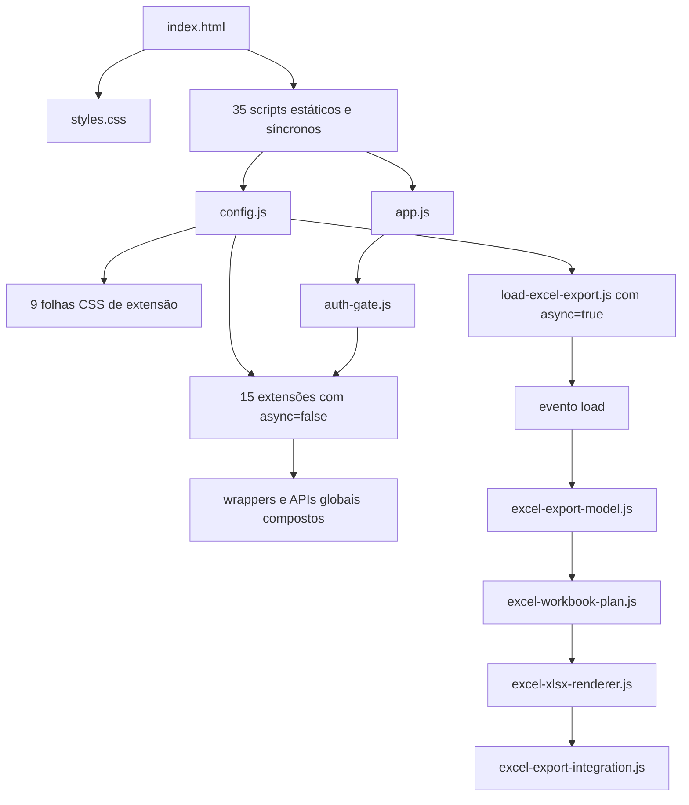

# Ordem de carregamento e precedência do frontend

## Finalidade

Este documento registra o contrato efetivo de carregamento do RADAR PDDE após o Ciclo A pós-PR 22. Ele deve ser consultado antes de reordenar, fundir, excluir ou renomear qualquer folha de estilo ou script de extensão.

A fonte reproduzível dos números e relações é [`../evidence/frontend-precedence/manifest.json`](../evidence/frontend-precedence/manifest.json). O comando de verificação é:

```bash
npm run audit:frontend-precedence:check
npm run test:frontend-precedence
```

## Visão geral



O grafo distingue ordem relativa de posição absoluta. O loader Excel é assíncrono e pode executar antes ou depois de algumas extensões ordenadas; seus quatro filhos continuam sequenciais e só começam após o evento `load`.

## Folhas de estilo

### Ordem efetiva

| Ordem | Arquivo | Blocos de regra | Ocorrências de seletor | Declarações | `!important` |
|---:|---|---:|---:|---:|---:|
| 0 | `styles.css` | 429 | 469 | 1.417 | 50 |
| 1 | `src/styles/mobile-responsive.css` | 58 | 111 | 242 | 6 |
| 2 | `src/styles/mobile-rendering-hotfix.css` | 18 | 48 | 46 | 10 |
| 3 | `src/styles/task-9-pendencias.css` | 93 | 110 | 306 | 2 |
| 4 | `src/styles/task-9-cross-view.css` | 22 | 24 | 41 | 0 |
| 5 | `src/styles/task-10-11-pendency-actions.css` | 24 | 26 | 97 | 0 |
| 6 | `src/styles/task-12-13-retificacoes.css` | 45 | 47 | 153 | 0 |
| 7 | `src/styles/cycle-b-carteira.css` | 37 | 39 | 95 | 0 |
| 8 | `src/styles/cycle-b-dashboard.css` | 35 | 39 | 99 | 0 |
| 9 | `src/styles/cycle-b-dashboard-final.css` | 12 | 13 | 32 | 0 |
| **Total** | **10 folhas** | **773** | **926** | **2.528** | **68** |

`config.js` acrescenta as nove extensões exatamente nessa ordem. Como todas são links no mesmo documento, a posição posterior participa da cascata mesmo quando o download termina em outra ordem.

### Como as colisões são medidas

Uma ocorrência é comparada por:

```text
contexto condicional + seletor exato + propriedade
```

Assim, `.card` no contexto global não colide com `.card` dentro de `@media (max-width: 900px)`. Seletores iguais no mesmo contexto são colisões somente quando a mesma propriedade recebe valores diferentes.

O estado atual contém:

- 161 seletores repetidos considerando qualquer contexto;
- 113 seletores presentes em mais de um contexto;
- 128 repetições no mesmo contexto;
- 68 repetições no mesmo contexto com ao menos uma propriedade divergente;
- 37 colisões entre arquivos diferentes;
- 31 colisões internas ao mesmo arquivo.

Das 37 colisões entre arquivos:

- 24 estão em `@media (max-width: 900px)`;
- 10 estão em `@media (max-width: 520px)`;
- 3 são globais.

As 34 colisões mobile concentram-se em `styles.css`, `mobile-responsive.css` e `mobile-rendering-hotfix.css`. Elas registram a solução vigente de layout e estabilidade de pintura; não são defeitos automaticamente.

As três colisões globais são:

| Seletor | Arquivos | Propriedades divergentes | Regra vigente |
|---|---|---|---|
| `.pendency-detail-marker` | `styles.css` → `task-9-pendencias.css` | `background`, `color`, `display`, `font-size`, `font-weight`, `padding` | Task 9 prevalece |
| `.pendency-row-selected` | `styles.css` → `task-9-pendencias.css` | `outline` | Task 9 prevalece |
| `.pendency-drawer-layer` | `task-9-pendencias.css` → `task-9-cross-view.css` | `z-index` | Cross-view prevalece |

Não existe colisão exata no mesmo contexto entre `cycle-b-dashboard.css` e `cycle-b-dashboard-final.css`. O segundo arquivo acrescenta estados selecionados, ações por linha, vazio e filtro de resultado. O nome `final` não significa que o primeiro possa ser removido.

## Scripts estáticos

O HTML carrega 35 scripts na seguinte ordem:

| Ordem | Script |
|---:|---|
| 1 | `src/domain/competencia.js` |
| 2 | `src/domain/estatisticas.js` |
| 3 | `src/domain/fluxo-operacional.js` |
| 4 | `src/domain/pendencias.js` |
| 5 | `src/domain/retificacoes.js` |
| 6 | `config.runtime.js` |
| 7 | `config.js` |
| 8 | `vendor/supabase-client.js` |
| 9 | `src/data/repository-contract.js` |
| 10 | `vendor/ajv.js` |
| 11 | `src/domain/json-contracts.js` |
| 12 | `src/application/error-mapper.js` |
| 13 | `src/auth/session-service.js` |
| 14 | `src/integration/auth-bootstrap.js` |
| 15 | `src/data/local-storage-repository.js` |
| 16 | `src/data/supabase-repository.js` |
| 17 | `src/data/repository-factory.js` |
| 18 | `src/data/snapshot-tools.js` |
| 19 | `src/data/import-coordinator.js` |
| 20 | `src/data/legacy-state-adapter.js` |
| 21 | `src/data/state-bridge.js` |
| 22 | `src/data/state-bridge-metadata.js` |
| 23 | `src/application/state-port.js` |
| 24 | `src/application/unit-of-work.js` |
| 25 | `src/application/data-service.js` |
| 26 | `src/application/configuration-service.js` |
| 27 | `src/application/directory-service.js` |
| 28 | `src/application/school-service.js` |
| 29 | `src/application/pendency-service.js` |
| 30 | `src/application/verification-service.js` |
| 31 | `src/application/audit-service.js` |
| 32 | `src/application/invoice-service.js` |
| 33 | `src/application/inventory-service.js` |
| 34 | `app.js` |
| 35 | `src/integration/auth-gate.js` |

`src/domain/retificacoes.js` possui `data-radar-extension` no HTML. Quando `config.js` tenta declará-lo novamente, o seletor de deduplicação encontra esse marcador. O arquivo executa uma única vez.

## Extensões ordenadas

Depois da deduplicação, quinze extensões usam `async = false` e preservam esta ordem relativa:

1. `src/domain/pendencias-view-model.js`;
2. `src/domain/operational-projection.js`;
3. `src/integration/mobile-navigation.js`;
4. `src/integration/modal-accessibility.js`;
5. `src/integration/task-9-pendencias-page.js`;
6. `src/integration/task-9-focus-bridge.js`;
7. `src/integration/task-9-cross-view.js`;
8. `src/integration/task-10-11-pendency-actions.js`;
9. `src/integration/task-12-13-retificacoes.js`;
10. `src/integration/cycle-b-carteira.js`;
11. `src/integration/cycle-b-dashboard.js`;
12. `src/integration/cycle-b-dashboard-result.js`;
13. `src/integration/task-10-alerts-competence.js`;
14. `src/integration/exercise-management.js`;
15. `src/integration/exercise-early-init.js`.

O teste com atraso artificial dos scripts posteriores a `config.js` comprovou que essa ordem relativa e a inicialização final continuam válidas no ambiente auditado.

## Loader Excel assíncrono

`src/integration/load-excel-export.js` usa `async = true`. Sua posição entre as extensões ordenadas variou durante a própria auditoria, comportamento válido e agora coberto pelo teste.

O contrato exigido é:

1. o loader executa uma vez;
2. registra o início após `load`;
3. carrega os quatro filhos com `await`, nesta ordem:
   - `src/domain/excel-export-model.js`;
   - `src/domain/excel-workbook-plan.js`;
   - `src/domain/excel-xlsx-renderer.js`;
   - `src/integration/excel-export-integration.js`;
4. `RadarExcelExportIntegration` fica disponível sem erro.

## Composição de globais

Os vinte arquivos efetivos analisados — dezesseis extensões e quatro filhos Excel — escrevem 66 nomes globais distintos e consultam 28 pré-requisitos explícitos por `typeof`.

Dois nomes possuem mais de um escritor:

| Global | Primeiro escritor | Segundo escritor | Consequência da ordem |
|---|---|---|---|
| `renderPendencias` | `task-9-pendencias-page.js` | `task-10-11-pendency-actions.js` | Task 10/11 captura e envolve o renderizador da Task 9 |
| `openPendencyDetail` | `task-9-pendencias-page.js` | `task-10-11-pendency-actions.js` | Task 10/11 envolve a abertura e acrescenta ações |

Outros wrappers de um único estágio também dependem do núcleo já disponível:

- `modal-accessibility.js` envolve `openModal` e `closeModal`;
- `task-9-cross-view.js` envolve `renderCompetencias`;
- `task-12-13-retificacoes.js` envolve `renderProntuario`, `toggleBonif` e `toggleConsEnviada`;
- `cycle-b-carteira.js` envolve busca, filtro, limpeza e renderização da Carteira;
- `cycle-b-dashboard.js` envolve o Dashboard do Controlador;
- `task-10-alerts-competence.js` envolve `getAlerts`;
- `exercise-management.js` envolve `renderSMEConfig`.

Nove módulos usam polling limitado para aguardar pré-requisitos, e três usam `MutationObserver` para acompanhar conteúdo produzido depois. Esses mecanismos fazem parte do comportamento atual; removê-los exige um entrypoint explícito e testes equivalentes.

## Regras para alterações futuras

1. Não mover `task-10-11-pendency-actions.js` antes de `task-9-pendencias-page.js`.
2. Não transformar o loader Excel assíncrono em script ordenado sem medir o impacto de carregamento.
3. Não remover `retificacoes.js` do HTML sem substituir a deduplicação e validar todos os consumidores.
4. Não excluir `cycle-b-dashboard.css` por causa do nome do arquivo posterior.
5. Não fundir os três arquivos mobile sem comparar computed styles e capturas nos breakpoints de 900 px e 520 px.
6. Não interpretar repetição entre contextos distintos como duplicação eliminável.
7. Reexecutar o manifesto, o teste de precedência, a baseline visual e os E2E das superfícies tocadas após qualquer mudança.

## Limites da auditoria estática

O analisador compara seletores exatos. Seletores diferentes ainda podem atingir o mesmo elemento por especificidade, herança ou ordem. Por isso, o manifesto não autoriza consolidação sozinho. O próximo pacote deverá acrescentar comparação de computed styles e evidência visual antes/depois para os elementos realmente alterados.
