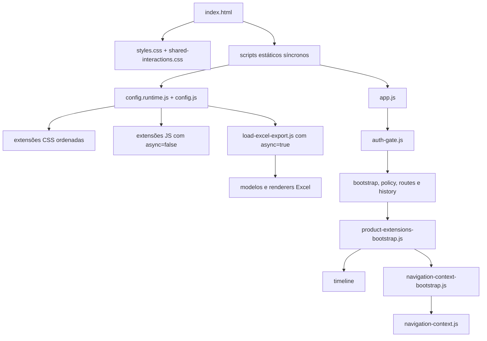

# Ordem de carregamento e precedência do frontend

**Estado:** vigente  
**Atualizado em:** 29 de julho de 2026

## 1. Finalidade

Registrar o contrato atual de carregamento do RADAR PDDE antes de reordenar, fundir, excluir ou renomear scripts e folhas de estilo.

A aplicação combina:

1. recursos estáticos declarados em `index.html`;
2. extensões ordenadas carregadas por `config.js`;
3. loader Excel assíncrono;
4. autenticação e rotas canônicas;
5. extensões de produto pós-`app.js`.

## 2. Fontes reproduzíveis

O manifesto em [`../evidence/frontend-precedence/manifest.json`](../evidence/frontend-precedence/manifest.json) representa a linha de base gerada pelo analisador na data de sua última regeneração. Ele não deve ser tratado como inventário eterno quando `index.html`, `config.js` ou os bootstraps mudarem.

Comandos canônicos:

```bash
npm run audit:frontend-precedence
npm run audit:frontend-precedence:check
npm run test:frontend-precedence
```

Após mudança estrutural, o manifesto deve ser regenerado pelo script. Não editar números manualmente para aparentar alinhamento.

## 3. Visão geral atual


```mermaid
flowchart TD
    HTML["index.html"] --> CSS0["styles.css + shared-interactions.css"]
    HTML --> STATIC["scripts estáticos síncronos"]
    STATIC --> CONFIG["config.runtime.js + config.js"]
    CONFIG --> CSSX["extensões CSS ordenadas"]
    CONFIG --> ORDERED["extensões JS com async=false"]
    CONFIG --> EXCEL["load-excel-export.js com async=true"]
    STATIC --> APP["app.js"]
    APP --> AUTH["auth-gate.js"]
    AUTH --> ROUTES["bootstrap, policy, routes e history"]
    ROUTES --> PRODUCT["product-extensions-bootstrap.js"]
    PRODUCT --> TIMELINE["timeline"]
    PRODUCT --> CONTEXT["navigation-context-bootstrap.js"]
    CONTEXT --> NAVCTX["navigation-context.js"]
    EXCEL --> XLSX["modelos e renderers Excel"]
```

A ordem relativa entre o loader Excel e alguns scripts síncronos não é usada como contrato. Os filhos do loader permanecem sequenciais depois do evento `load`.

## 4. Folhas de estilo

### 4.1 Estáticas

`index.html` declara:

1. `styles.css`;
2. `src/styles/shared-interactions.css`.

### 4.2 Extensões declaradas por `config.js`

Ordem atual:

1. `src/styles/mobile-responsive.css`;
2. `src/styles/mobile-rendering-hotfix.css`;
3. `src/styles/task-9-pendencias.css`;
4. `src/styles/task-9-cross-view.css`;
5. `src/styles/task-10-11-pendency-actions.css`;
6. `src/styles/task-12-13-retificacoes.css`;
7. `src/styles/cycle-b-carteira.css`;
8. `src/styles/cycle-b-dashboard.css`;
9. `src/styles/cycle-b-dashboard-final.css`;
10. `src/styles/painel-controlador-expressiva.css`.

### 4.3 Extensões pós-`app.js`

`product-extensions-bootstrap.js` carrega:

- `src/styles/school-timeline.css`.

A posição posterior participa da cascata. Download concluído fora de ordem não altera a posição do link no documento.

## 5. Colisões CSS

Repetição de seletor não é defeito automático. A auditoria considera:

```text
contexto condicional + seletor exato + propriedade
```

Regras:

- seletores em media queries diferentes não são a mesma ocorrência;
- especificidade, herança e ordem ainda podem afetar elementos mesmo sem colisão exata;
- `cycle-b-dashboard-final.css` complementa e não substitui `cycle-b-dashboard.css`;
- arquivos mobile não devem ser fundidos sem comparação de computed styles e capturas nos breakpoints vigentes;
- o novo arquivo do painel expressivo deve ser incluído em qualquer regeneração do manifesto.

## 6. Scripts ordenados por `config.js`

Depois da deduplicação por `data-radar-extension`, `config.js` declara com `async = false`:

1. `src/domain/pendencias-view-model.js`;
2. `src/domain/operational-projection.js`;
3. `src/domain/retificacoes.js`;
4. `src/integration/mobile-navigation.js`;
5. `src/integration/modal-accessibility.js`;
6. `src/integration/task-9-pendencias-page.js`;
7. `src/integration/task-9-focus-bridge.js`;
8. `src/integration/task-9-cross-view.js`;
9. `src/integration/task-10-11-pendency-actions.js`;
10. `src/integration/task-12-13-retificacoes.js`;
11. `src/integration/cycle-b-carteira.js`;
12. `src/integration/cycle-b-dashboard.js`;
13. `src/integration/cycle-b-dashboard-result.js`;
14. `src/integration/task-10-alerts-competence.js`;
15. `src/integration/exercise-management.js`;
16. `src/integration/exercise-early-init.js`;
17. `src/integration/painel-controlador-expressiva.js`.

`retificacoes.js` também possui marcador no HTML legado. A deduplicação impede segunda execução.

## 7. Composição de wrappers

A ordem é funcionalmente relevante quando módulos capturam APIs globais anteriores.

Exemplos vigentes:

- ações de pendência envolvem `renderPendencias` e `openPendencyDetail`;
- acessibilidade envolve `openModal` e `closeModal`;
- cross-view envolve `renderCompetencias`;
- retificações envolvem `renderProntuario`, `toggleBonif` e `toggleConsEnviada`;
- Carteira e Dashboard envolvem seus renderizadores e filtros;
- competência de alertas envolve `getAlerts`;
- gestão de exercícios envolve `renderSMEConfig`;
- timeline e navegação contextual compõem wrappers pós-`app.js`.

Mover um módulo antes do escritor de sua dependência pode capturar `undefined` ou substituir comportamento anterior.

## 8. Loader Excel

`src/integration/load-excel-export.js` usa `async = true` e inicia os módulos Excel após `load`.

O contrato é:

1. loader único;
2. filhos carregados sequencialmente;
3. modelo institucional e modelo SME disponíveis antes das integrações correspondentes;
4. nenhum CDN ou dependência remota no runtime;
5. falha explícita sem substituir silenciosamente o CSV.

A certificação integral executa os renderers reais fora do bundle do navegador e está descrita em [`excel-integral-certification.md`](excel-integral-certification.md).

## 9. Extensões pós-`app.js`

A cadeia detalhada está em [`product-extensions-load-order.md`](product-extensions-load-order.md).

Ordem resumida:

```text
navigation-routes.js
→ product-extensions-bootstrap.js
→ timeline
→ navigation-context-bootstrap.js
→ navigation-context.js
```

Essa cadeia possui promessas de readiness, marcadores idempotentes e degradação segura.

## 10. Polling e observadores

Polling limitado e `MutationObserver` fazem parte da compatibilidade atual com conteúdo produzido pelo núcleo legado. Removê-los exige:

- entrypoint explícito equivalente;
- prova de que todos os pré-requisitos continuam disponíveis;
- teste de ausência de duplicidade e recursão;
- validação de foco, renderização tardia e responsividade.

## 11. Regras para alterações futuras

1. não mover ações de pendência antes da página-base de Pendências;
2. não remover `retificacoes.js` do HTML sem validar deduplicação e consumidores;
3. não excluir `cycle-b-dashboard.css` por causa do arquivo `final`;
4. não fundir folhas mobile apenas por repetição de seletor;
5. não transformar o loader Excel em síncrono sem medir o carregamento;
6. acrescentar extensões pós-`app.js` ao bootstrap existente;
7. reexecutar auditoria, baseline visual, E2E e Lighthouse das superfícies tocadas;
8. regenerar o manifesto quando o conjunto efetivo mudar.

## 12. Limites da auditoria estática

O analisador não substitui inspeção visual. Seletores diferentes podem atingir o mesmo elemento por especificidade, herança ou ordem. Qualquer consolidação CSS exige computed styles e evidência visual antes/depois.
