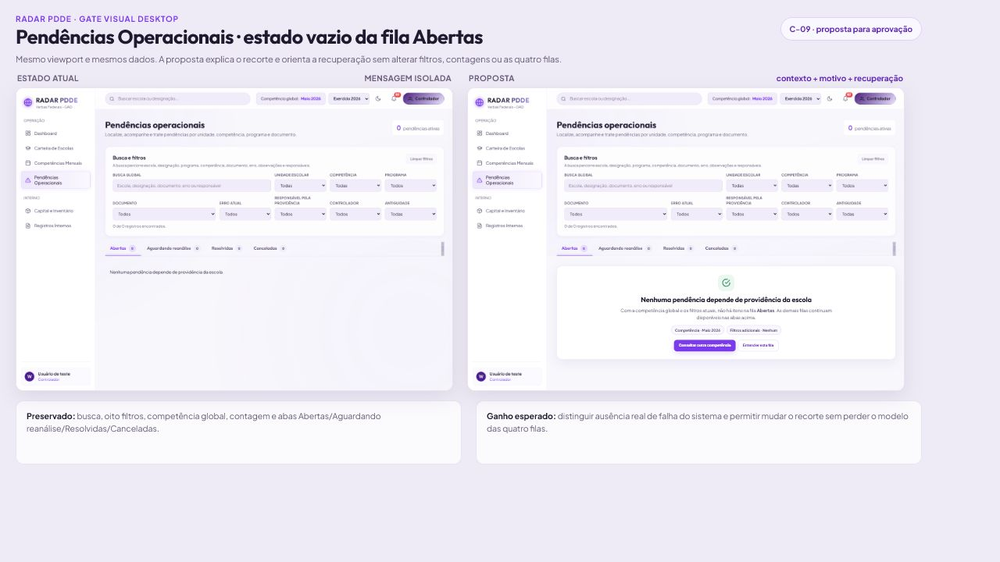
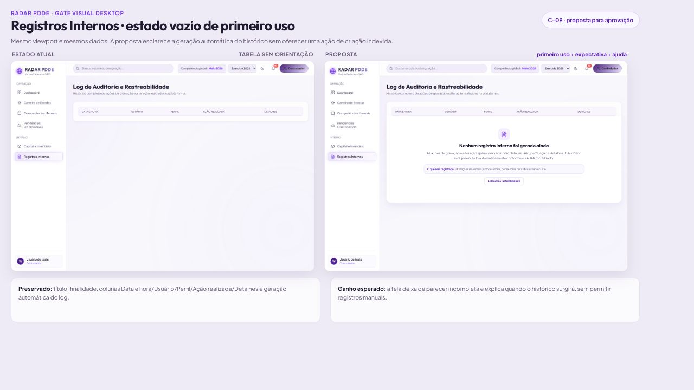

# Gate visual 01 — estados vazios no desktop

Data: 15/07/2026  
Status: proposta visual, sem implementação funcional  
Contrato aplicado: `C-09 — estados vazios`  
Escopo: Pendências Operacionais e Registros Internos  
Figma: [quadro do gate visual](https://www.figma.com/design/VVVjqKyaj0QnC9L63HT9yb/RADAR-PDDE-%E2%80%94-Auditoria-e-Polimento-Visual-Desktop?node-id=9-3&t=3mEQEC2NqCPE4ARa-0)

## Objetivo

Comprovar uma evolução visual antes de alterar a aplicação. As propostas abaixo usam o mesmo viewport, os mesmos dados e a mesma identidade do RADAR. Nenhuma regra, fila, filtro, permissão, persistência, CSS funcional ou comportamento de produção foi modificado.

## 1. Pendências Operacionais — fila Abertas sem resultados

### Situação atual

A página preserva filtros e quatro filas, mas o resultado vazio é comunicado apenas pela frase “Nenhuma pendência depende de providência da escola”. Não há explicação explícita do recorte nem caminho de recuperação junto ao resultado.

### Evolução proposta

- manter busca, oito filtros, competência global, contagem e quatro abas;
- transformar a frase isolada em um estado vazio estruturado;
- explicitar que o resultado pertence à fila `Abertas`, à competência global e aos filtros ativos;
- oferecer `Consultar outra competência`, reutilizando o seletor global existente;
- oferecer `Entender esta fila` como ajuda contextual, sem criar ou alterar pendências.

### Resultado esperado

O usuário distingue ausência real de falha ou carregamento incompleto, compreende o universo consultado e consegue mudar o recorte sem perder o modelo aprovado das quatro filas.

## 2. Registros Internos — primeiro uso sem eventos

### Situação atual

A superfície termina no cabeçalho da tabela e pode parecer incompleta. Não explica que os registros são gerados automaticamente nem quais operações aparecerão no histórico.

### Evolução proposta

- manter título, finalidade e colunas `Data e hora`, `Usuário`, `Perfil`, `Ação realizada` e `Detalhes`;
- explicar que o histórico será preenchido automaticamente conforme o uso;
- antecipar os grupos de operação auditados sem inventar eventos;
- oferecer somente ajuda contextual (`Entender a rastreabilidade`), sem botão de criação manual.

### Resultado esperado

A tela comunica primeiro uso de forma intencional, esclarece o valor futuro do histórico e preserva o caráter automático e imutável dos registros.

## Matriz de preservação

| Elemento | Conduta do mockup |
|---|---|
| quatro filas de Pendências | preservadas |
| separação entre aberta e aguardando reanálise | preservada |
| competência global | visível e contextualizada |
| filtros atuais | preservados e explicados |
| ausência de dados fictícios | preservada |
| geração automática do log | explicitada |
| colunas de auditoria | preservadas |
| identidade visual lilás/grafite | preservada |
| tipografias Outfit e Plus Jakarta Sans | preservadas |
| mobile | fora deste gate; regressão será protegida na implementação |

## Decisões ainda necessárias

Antes da implementação, o responsável pelo produto deve aprovar:

1. a direção visual dos dois estados;
2. a redação institucional proposta;
3. as duas ações contextuais de Pendências;
4. a ajuda contextual de Registros Internos.

Os botões apresentados são elementos de mockup. Nenhuma ação foi conectada ao site nesta etapa.

## Critérios de aceite para a futura implementação

- distinguir vazio real, vazio por filtro, falta de permissão e indisponibilidade;
- manter filtros ativos visíveis;
- usar título, motivo e ação recuperável conforme `C-09`;
- não inventar registros para preencher a tela;
- preservar acessibilidade por teclado, foco e leitura semântica;
- validar o mesmo fluxo no desktop e executar regressão mobile sem redesenho;
- apresentar comparação entre mockup aprovado e implementação antes do merge.

