# Auditoria visual desktop da produção — base para o polimento geral

## Resultado executivo

O RADAR PDDE possui uma identidade visual consistente e uma base de interação mais madura do que a diferença de acabamento entre módulos poderia sugerir. O Dashboard, o Prontuário e os diálogos recentes já devem funcionar como referências internas; não há fundamento para redesenhá-los do zero.

O principal salto de qualidade não depende de trocar paleta, tipografia ou framework. Ele depende de elevar legibilidade, orientação e escala operacional em cinco pontos:

1. tabelas largas e superfícies densas;
2. estados vazios;
3. hierarquia das áreas secundárias;
4. volume de filtros antes do resultado;
5. listas administrativas muito extensas.

Esta auditoria não altera aplicação, layout, dados, regras ou persistência. Ela estabelece evidência visual atual e o gate para os mockups que deverão anteceder qualquer mudança material.

O quadro visual editável está no Figma: [RADAR PDDE — Auditoria e Polimento Visual Desktop](https://www.figma.com/design/VVVjqKyaj0QnC9L63HT9yb). Ele organiza as doze capturas em referências protegidas, oportunidades de evolução e cinco gates de mockup, sem apresentar nenhuma proposta como aprovada.

## Fonte e limites

| Campo | Valor |
|---|---|
| Produção observada | `https://radarpdde-fix.vercel.app/` |
| Commit correspondente | `72c13a74a1c41e4c0fd4924c400e12d624af1482` |
| Viewport | 1440 × 1000, tema claro |
| Persistência | `LocalStorageRepository` |
| Supabase remoto | não conectado |
| Dispositivos | desktop somente, conforme decisão do responsável |
| Pesquisa com usuários | não realizada neste pacote |
| Mudança funcional/visual | nenhuma |
| Quadro Figma | `https://www.figma.com/design/VVVjqKyaj0QnC9L63HT9yb` |

Os dados pessoais ou de contato foram mascarados apenas no DOM da sessão de captura. A aplicação e os dados persistidos não foram alterados. O manifesto reproduzível está em [`../evidence/visual-polish-desktop/manifest.json`](../evidence/visual-polish-desktop/manifest.json).

## Percurso auditado

### 1. Dashboard do Controlador — saudável, preservar (`CP`)

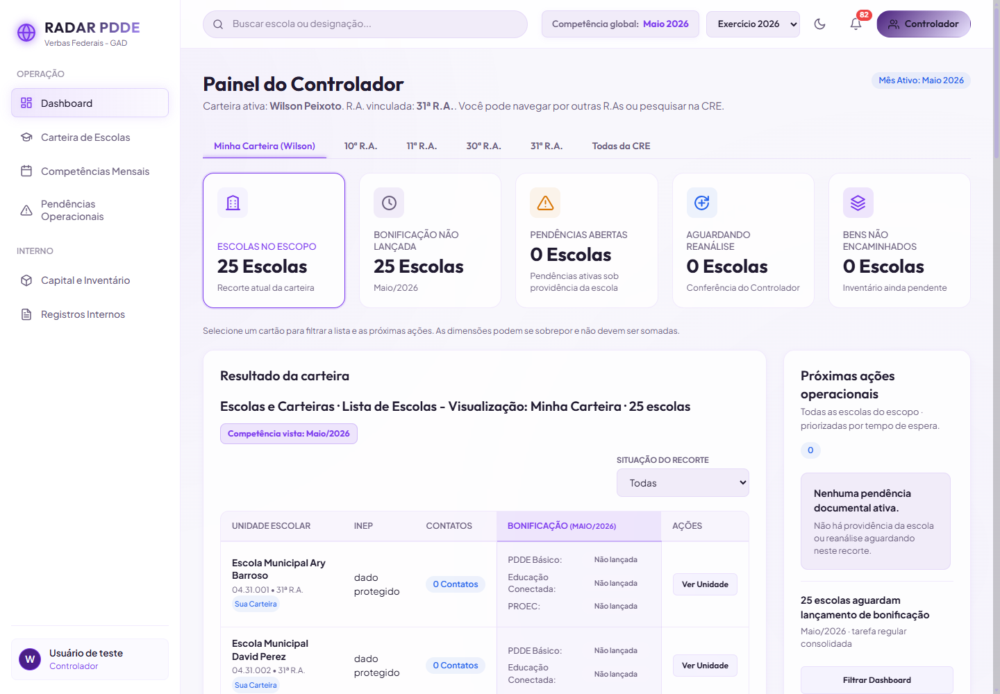

**Leitura:** shell, hierarquia, cartões, filtros e próximas ações formam uma composição clara. Os indicadores mantêm os universos operacionais separados e a tela comunica prioridade sem excesso decorativo.

**Conduta:** usar como referência de ritmo, tipografia e elevação. Polimento deve ser pontual; nenhuma reorganização dos indicadores está autorizada.

### 2. Carteira de Escolas — saudável com custo de varredura (`CP`, `FA`, `DQ`)

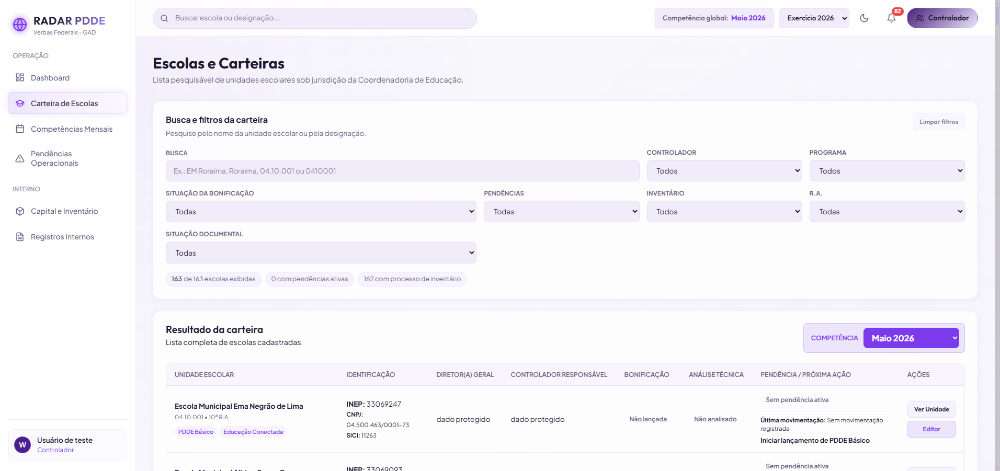

**Leitura:** busca, filtros e resumo do recorte são claros, mas ocupam grande parte do primeiro viewport antes do conteúdo. A tabela preserva onze colunas e usa largura mínima de 1.560 px; a decisão atual privilegia informação integral e exige rolagem horizontal.

**Conduta:** não remover campos. O próximo mockup deve comparar filtros essenciais sempre visíveis com filtros avançados expansíveis e testar colunas configuráveis mantendo um conjunto obrigatório. A escolha continua sendo `DQ-WAL-01`.

### 3. Competências Mensais — correta e densa (`CP`, `FA`)

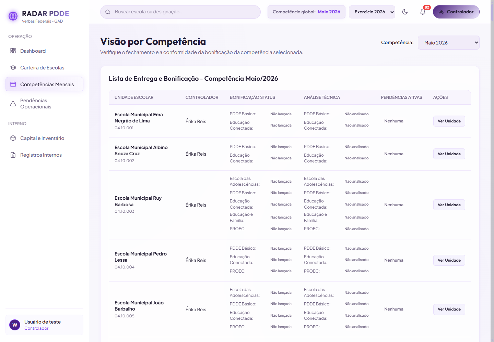

**Leitura:** a multidimensionalidade do domínio está preservada, mas a repetição de programas, estados e ações aumenta o esforço de comparação vertical.

**Conduta:** estudar cabeçalho/identificação persistentes e agrupamento visual, sem fundir bonificação, análise técnica e pendência.

### 4. Pendências Operacionais sem resultados — prioridade de polimento (`FA`, `IC`)

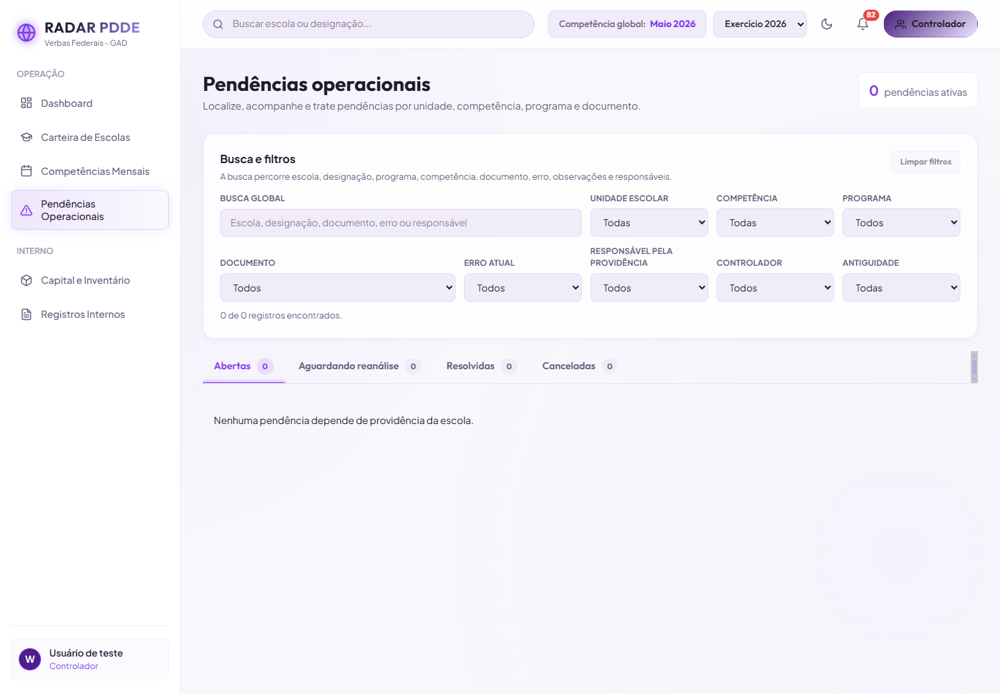

**Leitura:** os filtros são completos, porém dominam a página mesmo quando não existe resultado. O vazio é informado por texto simples e deixa grande área sem orientação sobre causa, recorte ou próxima ação.

**Conduta:** aplicar o contrato `C-09` com título, explicação do recorte, filtros ativos e ação possível. Não criar pendências fictícias nem ocultar as quatro filas.

### 5. Capital e Inventário — funcional, com leitura transversal limitada (`FA`)

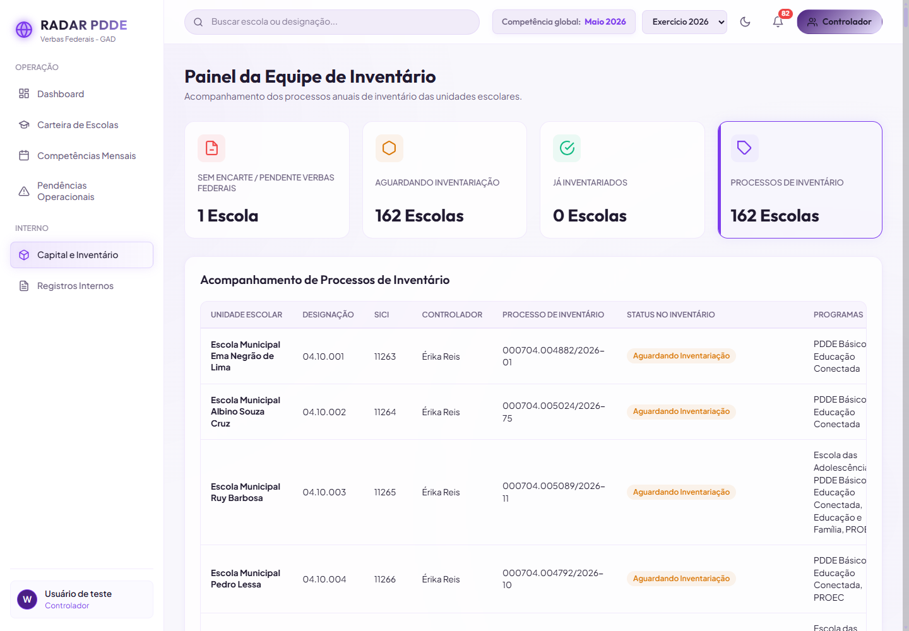

**Leitura:** cartões de síntese e tabela comunicam o domínio, mas a área de programas e o final das linhas perdem legibilidade no viewport. A rolagem existe, porém sua continuidade e o vínculo entre unidade, bem e próxima ação podem ser mais claros.

**Conduta:** propor coluna de identificação persistente, affordance de rolagem e hierarquia explícita da próxima ação. Preservar vínculo nota–bem–processo.

### 6. Registros Internos sem eventos — prioridade de paridade (`FA`, `IC`)

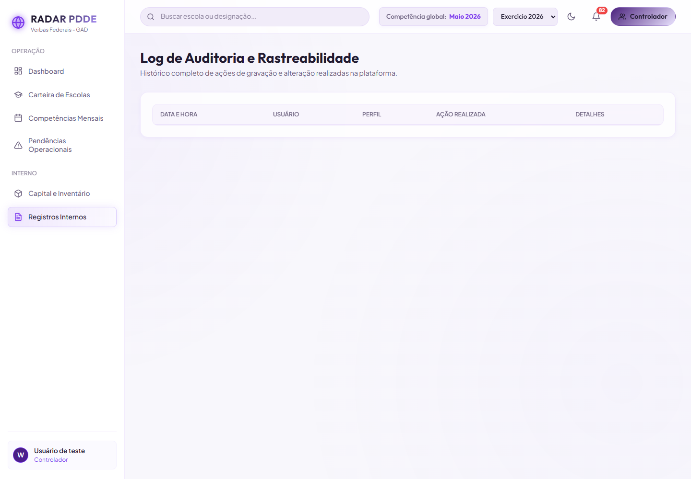

**Leitura:** a tela termina praticamente no cabeçalho da tabela. Não diferencia base vazia, filtro vazio, falta de permissão ou indisponibilidade, e não explica que tipos de eventos serão encontrados ali.

**Conduta:** é o candidato mais seguro para aplicar primeiro o sistema de estados vazios e ajuda contextual. A riqueza do modelo de auditoria não deve ser reduzida.

### 7. Dashboard SME — saudável, com tabela larga (`CP`, `FA`)

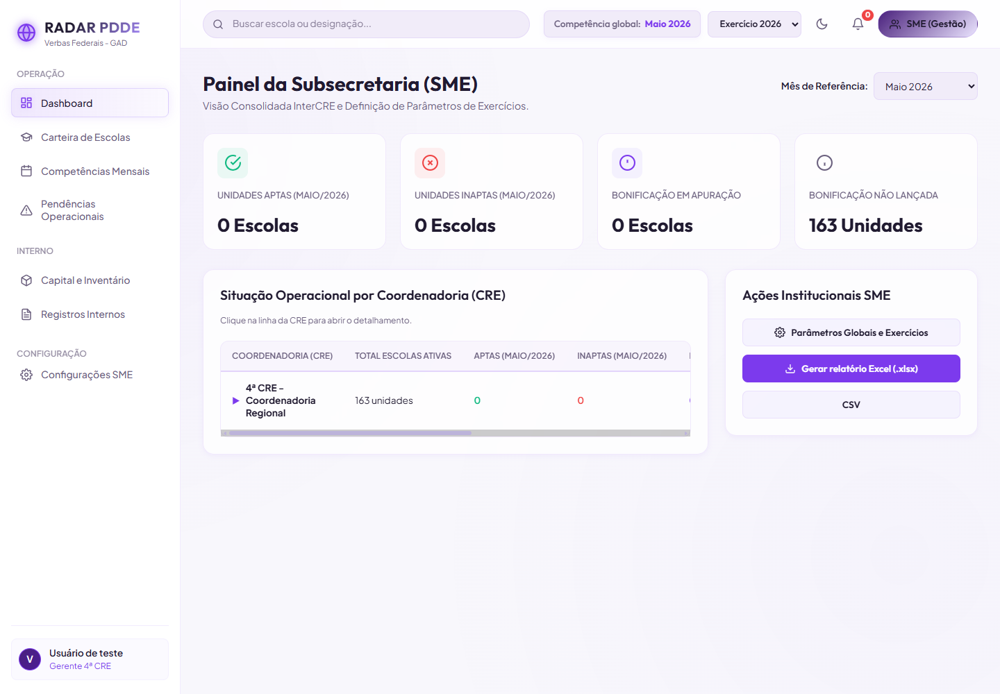

**Leitura:** cartões e ações institucionais possuem boa hierarquia. A tabela de coordenadorias exibe rolagem horizontal já no único registro, sinal de que o desenho deve ser testado com mais CREs sem comprometer comparação.

**Conduta:** preservar o painel; estudar somente legibilidade e escalabilidade da tabela.

### 8. Configurações SME — coerente, porém pouco orientada a estado (`FA`, `IC`)

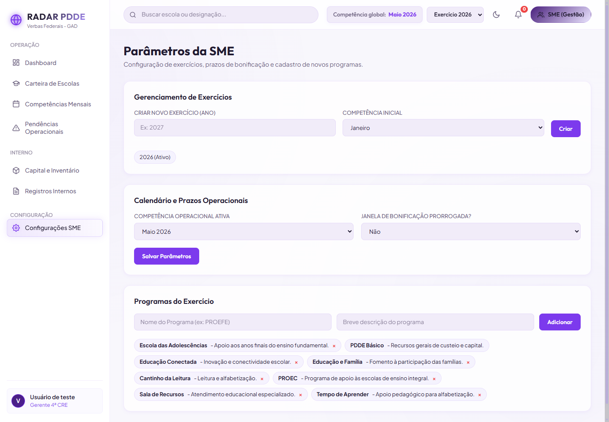

**Leitura:** os três blocos principais já compartilham a identidade visual do produto. Falta reforçar diferença entre estado atual, edição em curso e consequência de cada salvamento; a lista de programas usa controles compactos cuja ação destrutiva depende de contexto implícito.

**Conduta:** elevar feedback, obrigatoriedade e dirty state segundo `C-01`, `C-02`, `C-03`, `C-10` e `C-11`, sem transformar configuração em dashboard ornamental.

### 9. Prontuário — núcleo forte com alta densidade (`CP`, `FA`)

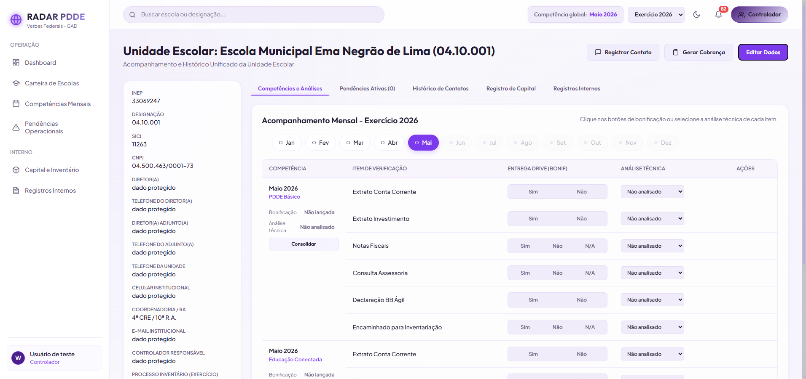

**Leitura:** é a superfície mais rica e conectada. A coluna institucional, cinco abas, seletor mensal e tabela de documentos competem no mesmo viewport; parte do conteúdo depende de rolagem horizontal.

**Conduta:** o mockup deve testar hierarquia e continuidade espacial, não remoção de conteúdo. Identidade da escola, competência e programa devem permanecer visíveis durante a operação.

### 10. Modal de edição da unidade — saudável, referência (`CP`)

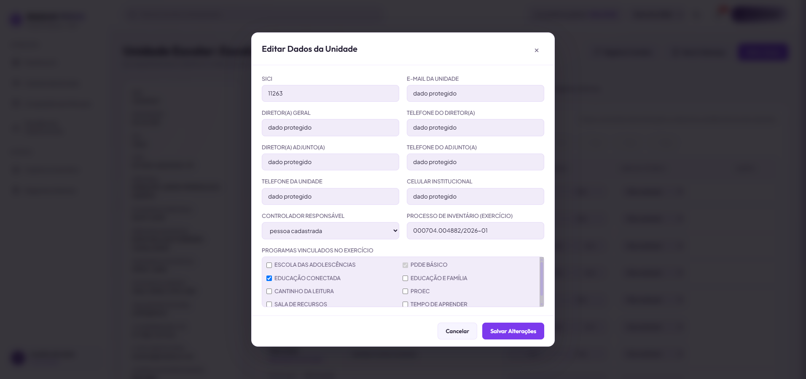

**Leitura:** título, agrupamento em duas colunas, rolagem interna e ações finais são claros. O modal abre com foco previsível, fecha por `Escape`, marca os modais fechados com `aria-hidden` e devolve o foco ao acionador.

**Conduta:** preservar como referência de diálogo/formulário. Melhorias futuras devem concentrar-se em validação por campo e indicação de alterações não salvas.

### 11. Gestão de Equipe — base forte, escala operacional insuficiente (`CP`, `FA`)

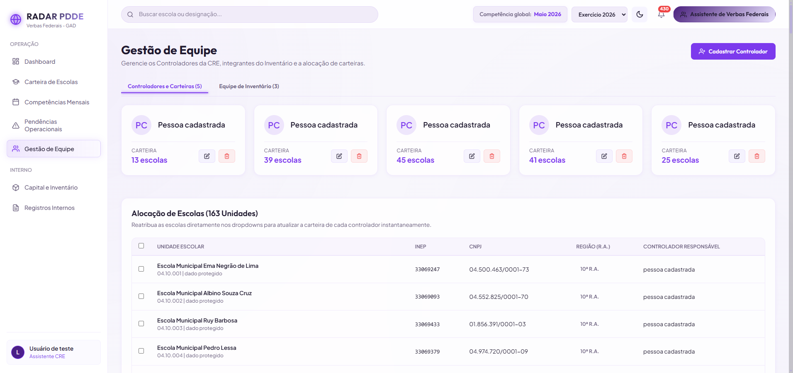

**Leitura:** os cartões permitem compreender distribuição de carteira rapidamente. A alocação renderiza 163 unidades em uma única página; o contêiner observado atingiu aproximadamente 11.474 px de altura. Isso torna localização, seleção e reatribuição custosas à medida que o volume cresce.

**Conduta:** priorizar busca, filtro, paginação ou virtualização e seleção orientada à tarefa. Não alterar a regra de reatribuição nem as contagens aprovadas.

### 12. Desativação de controladora — saudável, nova referência (`CP`)

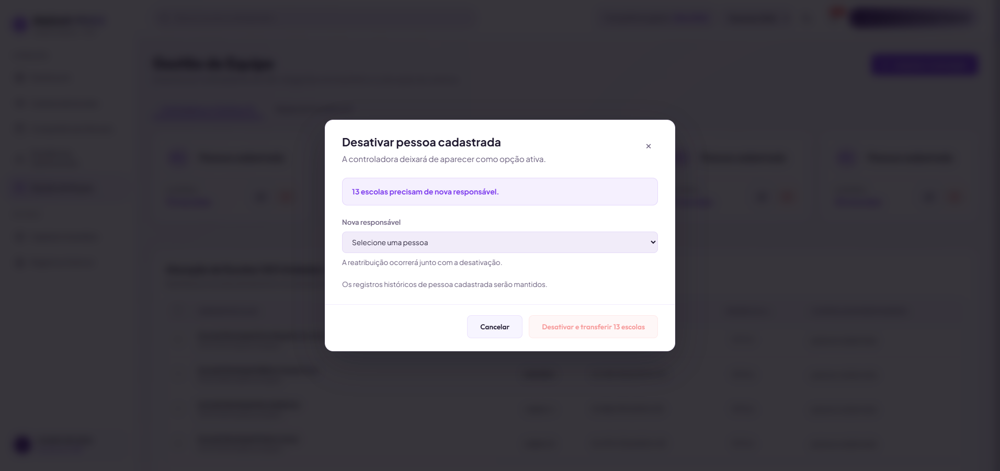

**Leitura:** o diálogo aprovado comunica objeto, consequência, quantidade de escolas, nova responsável e preservação histórica. A ação destrutiva permanece desabilitada até a escolha válida; `Escape` fecha e o foco retorna ao botão de origem.

**Conduta:** usar este fluxo como padrão para confirmações críticas futuras. Não simplificar para `confirm()` ou ação silenciosa.

## Qualidades protegidas

| ID | Qualidade | Evidência |
|---|---|---|
| `CP-VIS-D01` | identidade lilás/grafite, tipografia e raios formam sistema reconhecível | passos 1–12 |
| `CP-VIS-D02` | Dashboard é referência de hierarquia e leitura rápida | passos 1 e 7 |
| `CP-UX-D03` | diálogos recentes têm consequência explícita e ações claras | passos 10 e 12 |
| `CP-A11Y-D04` | Escape, `aria-hidden` e retorno de foco foram comprovados | passos 10 e 12 |
| `CP-DOM-D05` | interfaces preservam dimensões independentes do domínio | passos 1, 3, 4 e 9 |
| `CP-DEL-D06` | produção não apresentou `console.error` ou `console.warning` | percurso completo |

## Achados consolidados

### `FA-VIS-D01` — sistema de tabelas largas

Carteira (1.560 px), Pendências (1.320 px), Prontuário, Inventário e Dashboard SME dependem de rolagem horizontal. Isso não é defeito por si só: é consequência da informação aprovada. A evolução deve tornar a rolagem perceptível, preservar identificação durante o movimento e reduzir custo de varredura.

### `IC-VIS-D02` — estados vazios heterogêneos

Pendências e Registros Internos demonstram que ausência de registros ainda não possui apresentação única. O contrato `C-09` já resolve a capacidade; falta aplicá-lo por superfície, com texto institucional aprovado.

### `FA-VIS-D03` — filtros antes do conteúdo

Carteira e Pendências apresentam muitos controles no primeiro viewport. O ganho esperado não é esconder capacidade, mas distinguir recorte frequente de filtros avançados e manter o recorte atual sempre visível.

### `FA-VIS-D04` — escala da Gestão de Equipe

Os cartões são claros, mas a tabela integral de 163 unidades gera uma página de cerca de 11,5 mil px. Este é o achado novo mais objetivo desta auditoria e deve ser incorporado ao backlog de produtividade administrativa.

### `FA-VIS-D05` — hierarquia do Prontuário

O Prontuário concentra corretamente muita informação. O polimento deve manter identidade, competência e programa ancorados e reduzir competição visual entre navegação, contexto e lançamento.

## O que não foi classificado como problema

- a identidade visual atual;
- a separação dos indicadores do Dashboard;
- a existência de rolagem horizontal quando necessária;
- os modais fechados presentes no DOM, pois estão com `aria-hidden=true` e sem interação;
- o modo local e a ausência de Supabase remoto;
- mobile, deliberadamente fora deste pacote;
- a ausência de animação decorativa;
- a densidade decorrente de regra de negócio, sem antes testar alternativas.

Uma hipótese de retorno à Carteira com rolagem vertical deslocada não se repetiu após recarga e nova navegação; portanto não foi registrada como defeito.

## Atualização recomendada da sequência

A recomendação anterior de consolidar mobile fica postergada por decisão expressa. A nova sequência é:

1. **mockups desktop comparativos:** Carteira, Prontuário, Pendências vazias, Registros Internos e Gestão de Equipe;
2. **pacote V1 — base de polimento:** estados vazios, affordance de overflow, ritmo de cabeçalhos/cartões e feedback visual, sem mudar regras;
3. **pacote V2 — produtividade das superfícies largas:** Carteira, Prontuário, Competências e Inventário, condicionado às decisões de densidade;
4. **pacote V3 — paridade administrativa:** Gestão de Equipe, Configurações SME e Registros Internos;
5. **regressão mobile:** apenas para garantir que mudanças desktop não degradem a solução já aprovada; o redesenho mobile continua adiado.

Nenhum novo pacote deve ser instalado apenas para cumprir essa sequência. Dependências serão avaliadas depois de identificado o comportamento necessário e comparadas com a Web Platform e componentes existentes.

## Próximo gate visual

Antes de alterar CSS ou HTML, apresentar no mesmo viewport:

- captura atual;
- mockup proposto;
- comparação lado a lado;
- informação e ações preservadas;
- estados padrão, filtrado e vazio quando aplicável;
- consequência operacional esperada;
- critérios de regressão.

O primeiro conjunto deve usar o Dashboard e os dois diálogos saudáveis como referências internas, evitando que o polimento transforme o RADAR em outro produto.

## Conclusão

O RADAR não precisa de uma troca estética geral. Precisa de um sistema de acabamento que faça as superfícies mais densas e administrativas alcançarem o nível de clareza do Dashboard e dos diálogos recentes. A evolução mais segura começa por estados vazios e legibilidade de listas, avança para produtividade de tabelas e só depois reorganiza superfícies centrais mediante mockup e aprovação.
